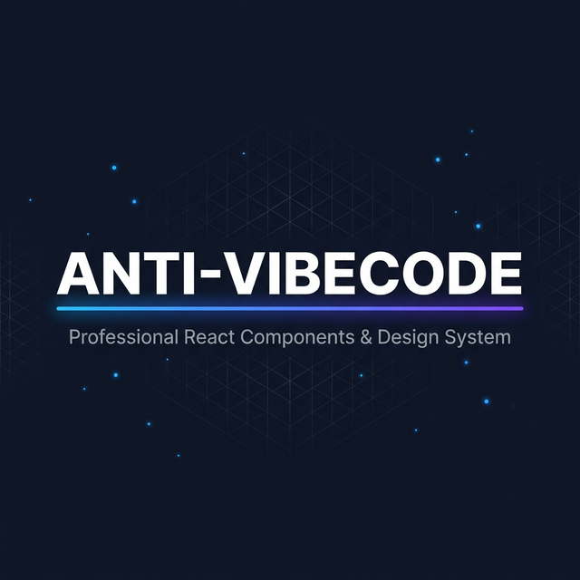
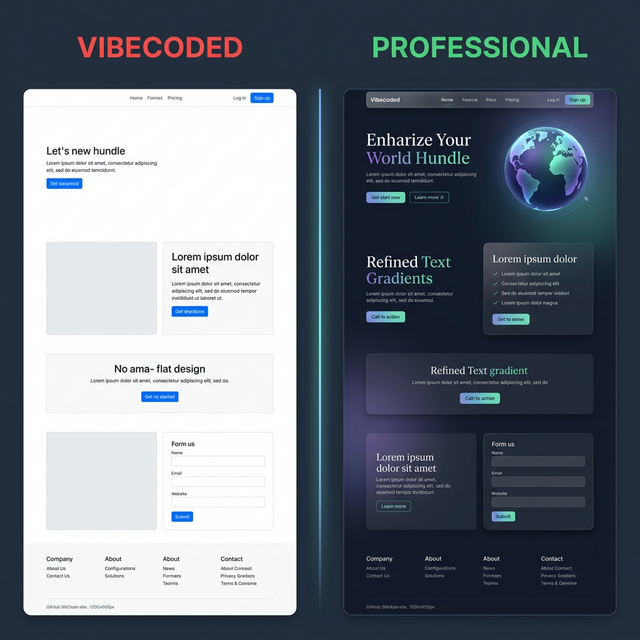
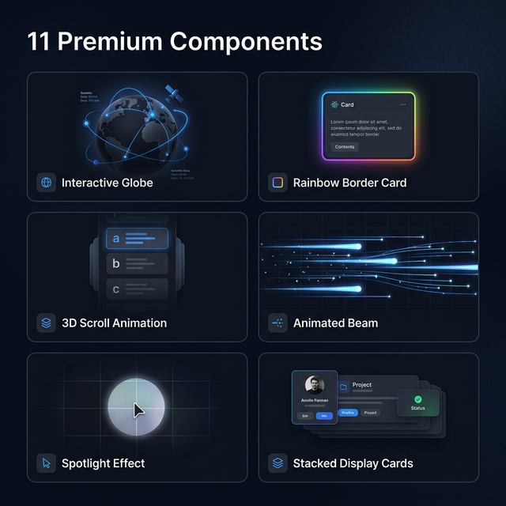

<p align="center">
  
</p>

<h1 align="center">⚡ Anti-Vibecode</h1>

<p align="center">
  <strong>Stop shipping websites that look AI-generated.</strong><br/>
  11 premium React components + a complete design system that makes AI output look like it was built by a senior designer.
</p>

<p align="center">
  <a href="https://economicdiffusion.hheuristics.com/">🌐 Live Demo</a> •
  <a href="#-the-full-ai-prompt">🤖 AI Prompt</a> •
  <a href="#-component-registry">📦 Components</a> •
  <a href="#-anti-vibecode-playbook">🎨 Design Guide</a> •
  <a href="https://hheuristics.com">🏠 HHeuristics</a>
</p>

<p align="center">
  
  
  
  
  
</p>

---

## 🤔 What is Vibecode?

**Vibecoded** = websites that _obviously_ look like they were generated by AI in 30 seconds. You know the look: default system fonts, flat white backgrounds, `bg-blue-500` buttons, no shadows, no depth, no soul.

**This repo is the antidote.**

<p align="center">
  
</p>

> **Left**: What AI typically generates. **Right**: What this repo teaches AI to generate instead.

---

## 🚀 Quick Start

```bash
git clone https://github.com/Nhughes09/reactcomponentshheuristics.git
cd reactcomponentshheuristics
npm install
npm run dev
```

---

## 📦 Component Registry

<p align="center">
  
</p>

All components live in `src/components/ui/` and follow shadcn/ui conventions.

| #   | Component            | File                             | What It Does                                                                   | Deps            |
| --- | -------------------- | -------------------------------- | ------------------------------------------------------------------------------ | --------------- |
| 1   | **InteractiveGlobe** | `interactive-globe.tsx`          | Canvas 3D globe with draggable rotation, arc connections, pulsing city markers | _None_          |
| 2   | **GlowingEffect**    | `glowing-effect.tsx`             | Mouse-tracking rainbow glow border that follows cursor                         | `motion`        |
| 3   | **ContainerScroll**  | `container-scroll-animation.tsx` | 3D perspective scroll animation with cinematic tilt reveal                     | `framer-motion` |
| 4   | **AnimatedHero**     | `animated-hero.tsx`              | Spring-physics animated title that cycles through words                        | `framer-motion` |
| 5   | **DisplayCards**     | `display-cards.tsx`              | Stacked cards with grayscale-to-color hover reveal                             | `lucide-react`  |
| 6   | **SplineScene**      | `splite.tsx`                     | Lazy-loaded Spline 3D scene wrapper                                            | `@splinetool/*` |
| 7   | **PulseBeams**       | `pulse-beams.tsx`                | Animated SVG beam paths with gradient pulses                                   | `framer-motion` |
| 8   | **Spotlight**        | `spotlight.tsx`                  | SVG animated spotlight effect for hero sections                                | _None_          |
| 9   | **BorderBeam**       | `border-beam.tsx`                | Animated gradient beam traveling along borders                                 | _None (CSS)_    |
| 10  | **RetroGrid**        | `retro-grid.tsx`                 | Perspective grid background with vanishing point                               | _None (CSS)_    |
| 11  | **Card**             | `card.tsx`                       | shadcn/ui Card with Header, Title, Content, Footer                             | _None_          |

<details>
<summary><strong>📖 Click to see usage examples for each component</strong></summary>

### InteractiveGlobe

```tsx
import { InteractiveGlobe } from "@/components/ui/interactive-globe";
<InteractiveGlobe size={460} dotColor="rgba(100, 180, 255, ALPHA)" />;
```

### GlowingEffect

```tsx
import { GlowingEffect } from "@/components/ui/glowing-effect";
<div className="relative rounded-2xl border p-1.5">
  <GlowingEffect
    spread={40}
    glow
    proximity={64}
    inactiveZone={0.01}
    borderWidth={3}
  />
  <div className="relative rounded-xl bg-white p-6">{/* Content */}</div>
</div>;
```

### ContainerScroll

```tsx
import { ContainerScroll } from "@/components/ui/container-scroll-animation";
<ContainerScroll titleComponent={<h2>Title</h2>}>
  <div className="w-full h-full bg-gradient-to-br from-sky-50 to-violet-50 p-12">
    {/* Content that gets 3D transforms on scroll */}
  </div>
</ContainerScroll>;
```

### PulseBeams

```tsx
import { PulseBeams } from "@/components/ui/pulse-beams";
<PulseBeams
  beams={beamConfig}
  gradientColors={{ start: "#0ea5e9", middle: "#6366f1", end: "#8b5cf6" }}
>
  <button>Connect</button>
</PulseBeams>;
```

### BorderBeam

```tsx
import { BorderBeam } from "@/components/ui/border-beam";
<div className="relative rounded-2xl">
  <BorderBeam size={250} duration={12} colorFrom="#0ea5e9" colorTo="#8b5cf6" />
</div>;
```

</details>

---

## 🤖 The Full AI Prompt

> **Copy-paste this entire prompt into Claude, Cursor, Copilot, or any AI coding assistant** to get professional-looking React websites instead of vibecoded output.

<details>
<summary><strong>🔥 Click to expand the full system prompt (copy this!)</strong></summary>

```
You are building a professional React website. Follow these rules strictly to avoid "vibecoded" output — websites that obviously look AI-generated.

## FONTS (CRITICAL — #1 vibecode tell)
- NEVER use browser default fonts. Always load Google Fonts explicitly.
- Use a SERIF font for headings and a SANS-SERIF font for body text.
- Recommended pairings:
  - Editorial: Playfair Display (headings) + Inter (body)
  - Modern SaaS: Outfit (headings) + Inter (body)
  - Enterprise: DM Serif Display (headings) + DM Sans (body)
  - Creative: Sora (headings) + Plus Jakarta Sans (body)
  - Startup: Cabinet Grotesk (headings) + Satoshi (body)
  - Financial: Lora (headings) + Source Sans 3 (body)
  - Luxury: Cormorant Garamond (headings) + Montserrat (body)
- Load fonts in layout.tsx with <link> tags and preconnect.
- Create a shared const for heading styles:
  const serif = { fontFamily: "'Playfair Display', Georgia, serif" };

## TYPOGRAPHY HIERARCHY
- h1: clamp(2.4rem, 5vw, 4.5rem), weight 700, letter-spacing -0.02em
- h2: clamp(1.8rem, 3.5vw, 2.6rem), weight 700, letter-spacing -0.015em
- h3: 1.1rem–1.25rem, weight 600–700
- Body: 14px–15px, weight 400, line-height 1.7
- Eyebrow labels: 10px–12px, weight 600, tracking 0.15em+, uppercase, sky-500 color
- Use clamp() for heading sizes, NOT Tailwind text-xl/text-4xl classes
- Use negative letter-spacing on large headings (tight tracking)
- NEVER use pill badges (rounded-full bg-blue-100) for section labels — use simple uppercase tracked text

## COLORS
- Primary text: slate-800 (NEVER text-black)
- Secondary text: slate-500
- Tertiary/captions: slate-400
- Heading accent: blue-900 (#1e3a8a)
- Primary accent: sky-500 (#0ea5e9)
- Secondary accent: violet-500 (#8b5cf6)
- Always use accent colors in PAIRS (sky + violet), never a single flat color
- Borders: gray-200 with /80 opacity modifier (border-gray-200/80)
- Gradients > flat colors: bg-gradient-to-r from-sky-500 to-violet-500
- Gradient text for emphasis:
  .gradient-text {
    background-image: linear-gradient(135deg, #0ea5e9, #8b5cf6, #0ea5e9);
    background-size: 200% auto;
    -webkit-background-clip: text; background-clip: text;
    -webkit-text-fill-color: transparent;
    animation: gradient-shift 4s ease infinite;
  }

## BACKGROUNDS (NOT FLAT WHITE)
- Every section needs a subtle gradient shader:
  <div className="absolute inset-0 bg-gradient-to-b from-white via-slate-50/40 to-white pointer-events-none" />
- Alternate shader colors between sections: slate-50/40, sky-50/30, slate-50/40, violet-50/20
- Add soft blurred orbs for visual depth:
  <div className="absolute top-0 right-0 w-[40%] h-[50%] rounded-full bg-sky-50/40 blur-[80px] pointer-events-none" />
- Content must be ABOVE shaders with className="relative"

## SPACING
- Section padding: py-24 (96px top/bottom)
- Section header margin-bottom: mb-14
- Card gaps: gap-3 to gap-4 (NOT gap-8 or gap-12)
- Inner card padding: p-5 to p-6
- Max content width: max-w-[1100px] (NOT max-w-7xl — too wide looks cheap)
- Always add px-6 horizontal padding

## SHADOWS & DEPTH
- Cards at rest: shadow-md shadow-slate-100/60
- Cards on hover: hover:shadow-lg hover:shadow-slate-200/60 hover:-translate-y-0.5 transition-all duration-300
- Hero cards: shadow-xl shadow-black/[0.04]
- NEVER use plain shadow-lg with no color control
- Use the 3-layer card pattern: glow wrapper → inner card → content

## NAVIGATION
- Fixed navbar with scroll-adaptive frosted glass:
  scrolled ? "bg-white/90 backdrop-blur-xl border-b border-gray-200/80 shadow-sm" : "bg-transparent"
- NEVER use "bg-white border-b border-gray-300" — too harsh

## ANIMATIONS
- Use framer-motion useInView for scroll-triggered animations on EVERY section
- Create reusable wrappers: AnimatedSection, StaggerChildren, FadeChild
- Use ease: [0.22, 1, 0.36, 1] as [number, number, number, number] for smooth curves
- Add stagger delays of 0.1–0.12s for list items
- Buttons need micro-animations: hover:translate, hover:shadow, group-hover on icons

## COMPONENT PATTERNS
- Status indicators: animated dot + muted text (NOT colored text labels)
- Stat displays: serif font numbers + uppercase tracked labels + vertical dividers between
- Section headers: reusable SectionHeader component with eyebrow, title, subtitle
- Data-driven rendering: arrays of objects + .map(), NEVER hardcoded repetitive JSX
- Shared style objects: define font styles as const, spread on elements

## BEFORE SHIPPING — VERIFY:
□ All headings use loaded serif/display font
□ No browser-default fonts anywhere
□ clamp() sizes on headings with negative letter-spacing
□ Every section has a gradient shader background
□ All cards have subtle colored shadows + hover elevation
□ Scroll animations on every section
□ Max width 1100px or less
□ No emoji in headings
□ Frosted glass nav with backdrop-blur
□ Accent colors in pairs (sky + violet)
□ Borders use /80 opacity
□ At least one interactive element
```

</details>

---

## 🎨 Anti-Vibecode Playbook

### The #1 Rule: Never Use Default Fonts

The single biggest difference between vibecoded and professional output:

```tsx
// ❌ VIBECODED — browser defaults, looks instantly AI-generated
<h1 className="text-4xl font-bold">Title</h1>;

// ✅ PROFESSIONAL — loaded serif font, fluid sizing, tight tracking
const serif = { fontFamily: "'Playfair Display', Georgia, serif" };
<h1
  style={{
    ...serif,
    fontSize: "clamp(2.4rem, 4vw, 3.5rem)",
    letterSpacing: "-0.02em",
  }}
>
  Title
</h1>;
```

### Recommended Font Pairings

| Style          | Heading            | Body              | Vibe                         |
| -------------- | ------------------ | ----------------- | ---------------------------- |
| **Editorial**  | Playfair Display   | Inter             | Authoritative, sophisticated |
| **SaaS**       | Outfit             | Inter             | Clean, contemporary          |
| **Enterprise** | DM Serif Display   | DM Sans           | Polished, corporate          |
| **Creative**   | Sora               | Plus Jakarta Sans | Fresh, design-forward        |
| **Startup**    | Cabinet Grotesk    | Satoshi           | Trendy, geometric            |
| **Financial**  | Lora               | Source Sans 3     | Trustworthy                  |
| **Dev Tools**  | Space Grotesk      | JetBrains Mono    | Technical, precise           |
| **Luxury**     | Cormorant Garamond | Montserrat        | Elegant, high-end            |
| **Blog**       | Fraunces           | Work Sans         | Literary, warm               |
| **Minimal**    | Manrope            | Manrope           | Swiss-style unified          |

### 🚫 Vibecoded vs Professional

| Vibecoded ❌               | Professional ✅                                    |
| -------------------------- | -------------------------------------------------- |
| `text-black` headings      | `text-slate-800` or `text-blue-900`                |
| Browser default fonts      | Loaded Google Fonts pair                           |
| `text-xl md:text-3xl`      | `clamp()` with line-height & letter-spacing        |
| Flat `bg-white` everywhere | Alternating gradient shaders per section           |
| `bg-blue-500` buttons      | `bg-gradient-to-r from-sky-500 to-violet-500`      |
| `shadow-lg` no color       | `shadow-md shadow-slate-100/60`                    |
| `rounded-lg` everything    | Mix: `rounded-xl`, `rounded-2xl`, `rounded-[10px]` |
| 🚀 📊 ⚡ emoji in headings | Lucide React icons in styled containers            |
| `px-4 py-2` tight padding  | `p-6` to `p-14` generous whitespace                |
| `gap-4` everywhere         | Varied: `gap-2.5`, `gap-3.5`, `gap-6`              |
| No scroll animations       | `useInView` + `motion` on every section            |
| Pill badges on labels      | Uppercase tracked text, no container               |
| `max-w-7xl` (too wide)     | `max-w-[1100px]` (premium narrow)                  |
| "Click Here" buttons       | Descriptive text + icon + hover animation          |
| `border-gray-300` harsh    | `border-gray-200/80` subtle                        |
| Static nav                 | Frosted glass `backdrop-blur-xl` scroll-adaptive   |

### Background Depth System

```tsx
// Every section needs this — NOT flat white
<section className="relative py-24 px-6">
  <div className="absolute inset-0 bg-gradient-to-b from-white via-slate-50/40 to-white pointer-events-none" />
  <div className="relative max-w-[1100px] mx-auto">{/* content */}</div>
</section>
```

Alternate shader colors: `via-slate-50/40` → `via-sky-50/30` → `via-slate-50/40` → `via-violet-50/20`

### Shadow & Elevation System

```tsx
// Cards at rest
"shadow-md shadow-slate-100/60";

// Cards on hover
"hover:shadow-lg hover:shadow-slate-200/60 hover:-translate-y-0.5 transition-all duration-300";

// Hero card
"shadow-xl shadow-black/[0.04]";
```

### Animation Wrappers (Reuse These)

```tsx
function AnimatedSection({ children, className, id }) {
  const ref = useRef(null);
  const isInView = useInView(ref, { once: true, margin: "-60px" });
  return (
    <motion.section
      ref={ref}
      id={id}
      initial={{ opacity: 0, y: 40 }}
      animate={isInView ? { opacity: 1, y: 0 } : { opacity: 0, y: 40 }}
      transition={{ duration: 0.7, ease: [0.22, 1, 0.36, 1] }}
      className={className}
    >
      {children}
    </motion.section>
  );
}
```

### Pre-Ship Checklist

- [ ] All headings use loaded serif/display font
- [ ] Body uses loaded sans-serif (Inter, DM Sans, etc.)
- [ ] `clamp()` sizes on headings with negative letter-spacing
- [ ] Every section has gradient shader background
- [ ] All cards have colored shadows + hover elevation
- [ ] Scroll-triggered animations on every section
- [ ] Max width ≤ 1100px
- [ ] No emoji in headings or labels
- [ ] Frosted glass nav with `backdrop-blur`
- [ ] Accent colors in pairs (sky + violet)
- [ ] Borders use `/80` opacity modifier
- [ ] At least one interactive element (globe, glow, 3D)
- [ ] Buttons have hover micro-animations

---

## 📐 Architecture

```
src/
├── app/
│   ├── globals.css          # Design tokens, animations, utilities
│   ├── layout.tsx           # Root layout with fonts, SEO
│   └── page.tsx             # Main page (all sections)
├── components/ui/           # 11 premium components (shadcn convention)
│   ├── interactive-globe.tsx
│   ├── glowing-effect.tsx
│   ├── container-scroll-animation.tsx
│   ├── animated-hero.tsx
│   ├── display-cards.tsx
│   ├── splite.tsx
│   ├── pulse-beams.tsx
│   ├── spotlight.tsx
│   ├── border-beam.tsx
│   ├── retro-grid.tsx
│   └── card.tsx
└── lib/utils.ts             # cn() class merge utility
```

---

## 📋 Dependencies

```bash
npm install motion framer-motion lucide-react
npm install @radix-ui/react-slot class-variance-authority clsx tailwind-merge
npm install @splinetool/react-spline @splinetool/runtime  # optional: 3D scenes
```

---

<p align="center">
  <strong>Built by <a href="https://github.com/Nhughes09">@Nhughes09</a> for <a href="https://hheuristics.com">HHeuristics</a></strong><br/>
  <sub>MIT License</sub>
</p>
